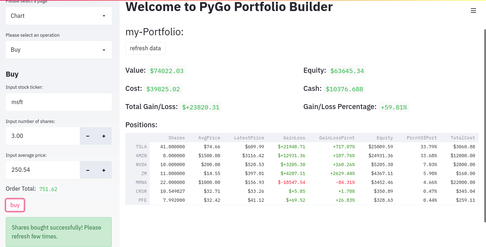
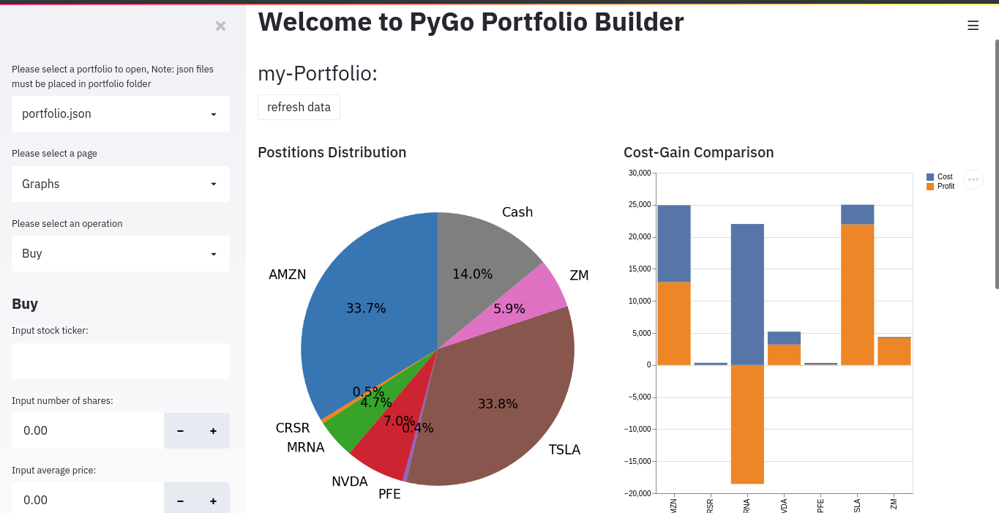
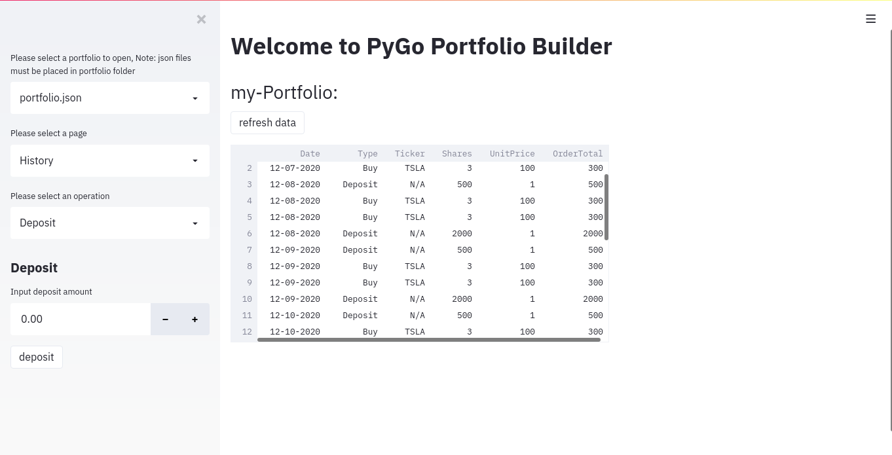
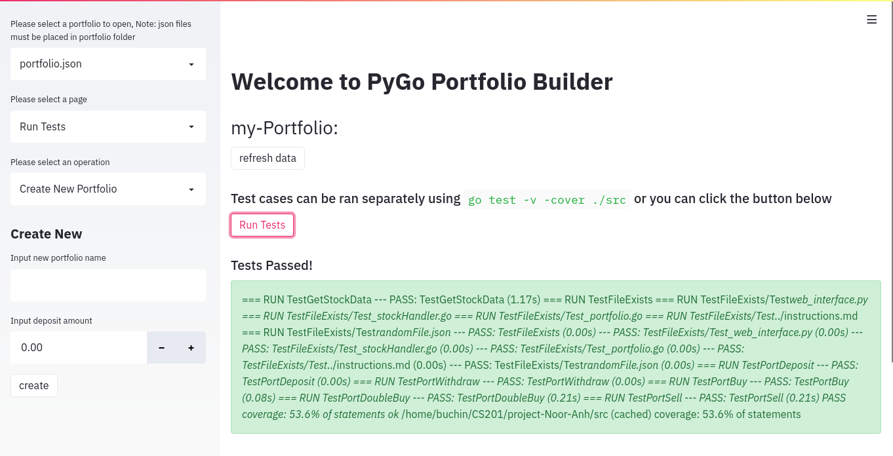

# PyGo Stock Portfolio Builder

## Tool Design

Our program design is the combining structure of Golang and Python. There are
three main files in our tool, which are `portfolio.go`, `stockHandler.go`, and
`web_interface.py`. Additionally, out test cases are in `portfolio_test.go`.
While `portfolio.go` and `stockHandler.go` are served as the back-end of the
program, `web_interface.py` is the front-end. The motivation behind this project
is to facilitate tracking and organizing an investment portfolio to equip the
user with the most up to date information in order to make the best investment
decisions. We were in need of tools like this since we started making
investments and we thought it would be great to make one ourselves. The overall
goal of this tool is to track a set of stock market positions for multiple
portfolios, store the data, and display it using meaningful graphs and charts.
In this tool, there are numbers of packages that are installed to support the
program. For Golang, `piquette/finance-go` package is used to get access to the
latest stock data. Additionally, we used some built-in Golang packages for
encoding JSON files, implementing command line interface, and creating a unit
test suite. For Python, we used `pipenv` and it's `Pipfile` to manage the
installation of our dependencies and packages. Some of the used packages are
`pandas` for data manipulation, `shlex` for formatting system commands before
running, `matplotlib.pyplot` and `altair` for creating the visual plots such as
bar charts and pie charts, and `streamlit` to implement graphical interface and a
web application for our application. We also used `Yfinance` to validate stock
tickers added by the user. The design of our tool involves a front end section
that takes and validates user input. Following that, it runs specific system
commands to send arguments to the backend portion. The back-end part uses object
oriented programming to create and manipulate Go structures while also storing
the information in json files. Overall, this organization allow us to combine
the Python's elegant and user friendly graphical interface with Golang's efficient
object oriented programming and data processing.

## Installation

### Prerequisites

#### Python Environment

Python makes up all front-end aspects of this project. Specifically, web application and data retrieval are done using Python. To ensure that all Python components run smoothly, you will need to install:

- A version of Python preferably through Pyenv
- Pip, a Python package manager
- Pipenv, used create a Python virtualenv and retrieve needed packages. This package can be installed using:

```bash
pip install pipenv
```

#### Golang Environment

Back-end operations and calculations, as well as data storage are made possible through Go. The following prerequisites are needed:

- A new version of Go (1.14 or 1.15)
- `finance-go` package, can be installed using:

```bash
go get github.com/piquette/finance-go
```

### Web Application

After all needed packages and tools are installed, the Python virtual environment needs to be created in the repository's root using:

```bash
pipenv install
```

This might take some time to locate all dependencies and create `Pipfile.lock`.
However, once this is completed, you can run the tool's web application from the
root of the repository using:

```bash
pipenv run streamlit run src/web_interface.py
```

### Using Back-end Independently

`stockHandler.go` implements a command line interface that manages all
operations and stores data. If you wish to use that without the web interface,
you can follow the steps below:

- build all modules: `go build src/stockHandler.go src/portfolio.go`
- run the newly created stockHandler file using client line argument flags, example:
  - Deposit: `./stockHandler -f my_portfolio.json -o deposit -s 500`
  - Withdraw: `./stockHandler -f my_portfolio.json -o withdraw -s 500`
  - Buy: `./stockHandler -f my_portfolio.json -o buy -t TSLA -s 54.345 -p 20`
  - Sell: `./stockHandler -f my_portfolio.json -o sell -t TSLA -s 54.345 -p 43`

The test suite for the tool can be run using the following command or through
the web application:

```bash
go test -v -cover ./src
```

### Supported flags

- File Name

  - Flag: `-f`
  - Required: `True`
  - Type: string
  - Must contain the file format as `.json`

- Operation

  - Flag: `-o`
  - Required: `False`
  - Type: string
  - Possible arguments: `buy`, `sell`, `withdraw`, `deposit`

- Ticker

  - Flag: `-t`
  - Required: `False`
  - Type: string
  - Example argument: `tsla`, `MSFT`, `amzn`

- Shares

  - Flag: `-s`
  - Required: `False`
  - Type: float
  - In the case of using deposit or withdraw, the amount should be sent as a
    shares argument

- Price

  - Flag: `-p`
  - Required: `False`
  - Type: float
  - Used to input the **price per share** of the purchased/sold stock

- Refresh
  - Flag: `-r`
  - Required: `False`
  - Type: boolean
  - Could be sent alone to call the refresh function on the portfolio file

## Program Implementation

There are three major files in our tool, each offers a distinct implementation
and communicate with the others in specific ways. The first one is
`portfolio.go`, which is the foundation of our program. The purpose of the file
is to create the structure of the portfolio, stocks, and entry objects. It also
contains functions for getting stock information, buying and selling stocks,
deposit and withdrawing the cash, and most importantly, refreshing the data and
creating a new portfolio. In these functions, `buy` and `sell` are the act of
buying and selling stocks. It collect the stock ticker that users chooses,
number of shares, and the price that these share were purchased or sold at. It
then updated the `Positions` map in the portfolio object accordingly and
recalculates totals. In the `deposit` and `withdraw` function, it tells users if
they want to add or take the money from their portfolio. These functions will
check the current amount of cash exiting in the portfolio and make the
calculation to update the new amount. `RefreshData` is another important
function that iterates through all values of the portfolio and calculates
totals, percentages, and fetches latest stock prices. Following that, it updates
the instance variables of the portfolio structure. This file is the foundation
of the tool because it implements the objects structure and the basic functions
needed to manipulate it.

The next file is `stockHandler.go`, which is also the back-end file. This file
is served as the brain of the tool. `stockHandler.go` functions to handle and
parse command line arguments as well, check for input error, handle file
creation, and retrieve the data as a portfolio object. It also calls
appropriate functions sending parameters based on user input. This section of
the tool can be ran independently using the command line interface it implements.

`web_interface.py` is the front-end implementation that allows us to create the
graphical interface of the program. The implementation uses Python and the
Streamlit library to create and run the interface. Specifically, it allows users
to check the updating status of their portfolio by showing the positions, cost,
value, cash, gain/loss percentages, and total amount that they gain or loss with
these stocks. All of this previously mentioned data is directly retrieved from
the json files storing it. Additionally, the web interface sets up widgets such
as buttons, text boxes, dropdown menus to take in user input. Once user input is
added and the buttons to submit are clicked, `web_interface.py` determines the
appropriate command to run and uses shlex and subprocess to do that. This causes
a change in the data stored in the json file. The user can then refresh their
page to display the latest information in a table show in the main page. In
addition to sending commands to updated the data, the web interface provides
informative visual representation of the data using altair and matplotlib. The
interface allows the user to access the page with the graphs through a drop down
menu. In that page, four charts can be seen, a pie chart showing the proportions
that each stock makes up in the portfolio, a bar chart that compares the cost
and gain/loss in dollars for each stock, a horizontal bar chart comparing the
profitability percentage of each stock, and finally, a bar chart showing user
activity since the portfolio was created. The last graph uses the history
functionality that records and stores information about each operation done in
the past. The history information can be seen in the History page of the web
interface, where a table is shown. The web interface also contains
functionalities for creating a new portfolio and switching between the
portfolios stored in the `Portfolio` folder. The test suite can also be ran
using the web interface and the results would be shown there. Overall, the web
interface is able to handle all possible user input and display important
messages that update the user and display any error messages.

## Output Examples

### Tool Screenshots






### Test Suite Output

```bash
buchin@buchin:~/CS201/project-Noor-Anh$ go test -v -cover ./src
=== RUN   TestGetStockData
--- PASS: TestGetStockData (1.17s)
=== RUN   TestFileExists
=== RUN   TestFileExists/Test_web_interface.py
=== RUN   TestFileExists/Test_stockHandler.go
=== RUN   TestFileExists/Test_portfolio.go
=== RUN   TestFileExists/Test_../instructions.md
=== RUN   TestFileExists/Test_randomFile.json
--- PASS: TestFileExists (0.00s)
    --- PASS: TestFileExists/Test_web_interface.py (0.00s)
    --- PASS: TestFileExists/Test_stockHandler.go (0.00s)
    --- PASS: TestFileExists/Test_portfolio.go (0.00s)
    --- PASS: TestFileExists/Test_../instructions.md (0.00s)
    --- PASS: TestFileExists/Test_randomFile.json (0.00s)
=== RUN   TestPortDeposit
--- PASS: TestPortDeposit (0.00s)
=== RUN   TestPortWithdraw
--- PASS: TestPortWithdraw (0.00s)
=== RUN   TestPortBuy
--- PASS: TestPortBuy (0.08s)
=== RUN   TestPortDoubleBuy
--- PASS: TestPortDoubleBuy (0.21s)
=== RUN   TestPortSell
--- PASS: TestPortSell (0.21s)
PASS
coverage: 53.6% of statements
ok  _/home/buchin/CS201/project-Noor-Anh/src  (cached)  coverage: 53.6% of statements
```

The output shown above tests the backend operation done to the Portfolio
structure and its functionalities. Some aspects could not be tested since they
are dependent on changing stock market prices. The graphical interface was also
tested with a variety of input to ensure that error messages are minimal.

## Feedback

Thank you for checking out our tool! We would appreciate any feedback through
the issue tracker and pull requests.

This tool was built by [@noorbuchi](https://github.com/noorbuchi) and [@tonyanh1710](https://github.com/tonyanh1710)
